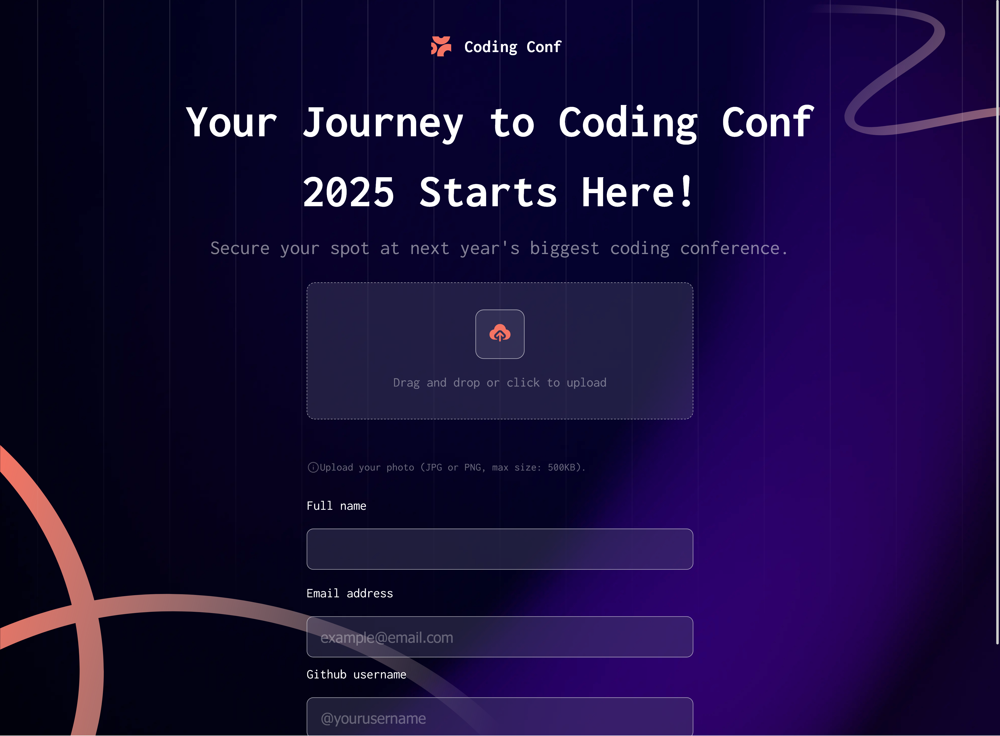
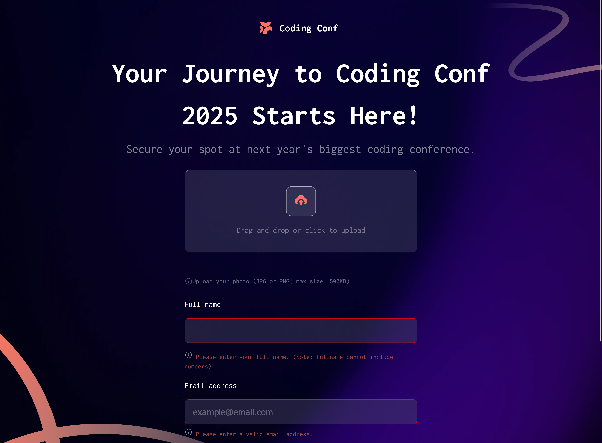
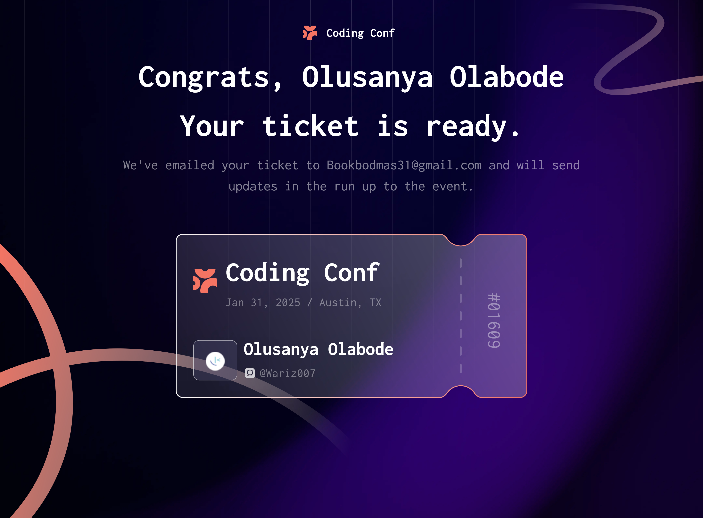

Date: 27th of December, 2024
Project Title: Frontend Mentor Conference ticket generator

This README file is a personal note to self to list the things I learnt, found challenging, and problems I haven't solved so I can revisit in future and see how I solved the problem in case I encounter the difficulty again in future, and to also note problems I haven't solved so I can learn how to fix such problems.

Diffculty:
1. Img Preview Difficulty:
The primary diffulcuty I encountered in this project was getting the user's image show as a preview in the little box container. The problem is one I haven't encountered in any of my JavaScript tutorials so that is why it was diffcult to solve. I did some research to see how I could solve the problem but the conflicting answers were confusing and ChatGPT wasn't that helpful either. 

I guess it is JS problem that requires a proper understanding of what you're trying to do and how to get it done, and not something that you can just slap a formula on to solve. I will read through the code of other participants that have solved this on Frontend Mentor.

2. Regex: 
I like working with Regex because of how much control it gives me. However, it is very confusing because of the combination of letters and symbols. I need to get very good at this. I love Regex.

Lessons Learnt:
1. JavaScript DOM:
I got more confident with JavaScript DOM. Due to previous practice I've done in the past, I was able to write the validation code myself and also add some personal touch of my own that weren't specified in the practice instructions. Something I also observed is that working with DOM is actually interesting and very powerful if you have an in-depth understanding of the tools you need. So, I plan to practice this even more so I can manipulate things as much as I want.

2. Layout:
The page layout was simple but I made a mistake not including HTML semantics like header and main. I've gone too deep into the project before I realized the semantic tags needed to be added. I also tried to fix it but my tags were too nested into each other that attempting to fix it will cost too much. But that's the essence of practice; to make mistakes and take note of them so you don't make the same mistakes in the next project.

3. I am also getting more confident with media queries. Media queries are simple but my obsession with making sure the page is responsive for every screen size is making me uncomfortable with the little I currently know. I think the media queries in the project could have been better. I plan to take Kevin Powell's free course on responsive design so that should help.

4. Write Clean Code:
I am starting to get better at this as it makes navigating through the project a lot easier and convenient.

Things to Research and Learn:
- How to work with user uploaded image
- Regex
- Media queries

Snapshots:

